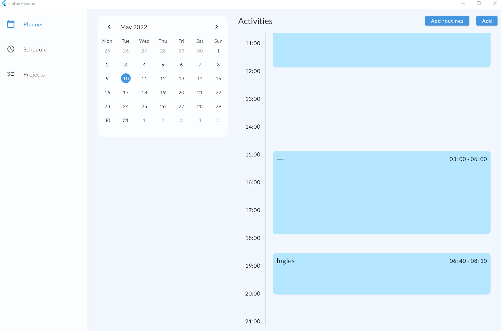
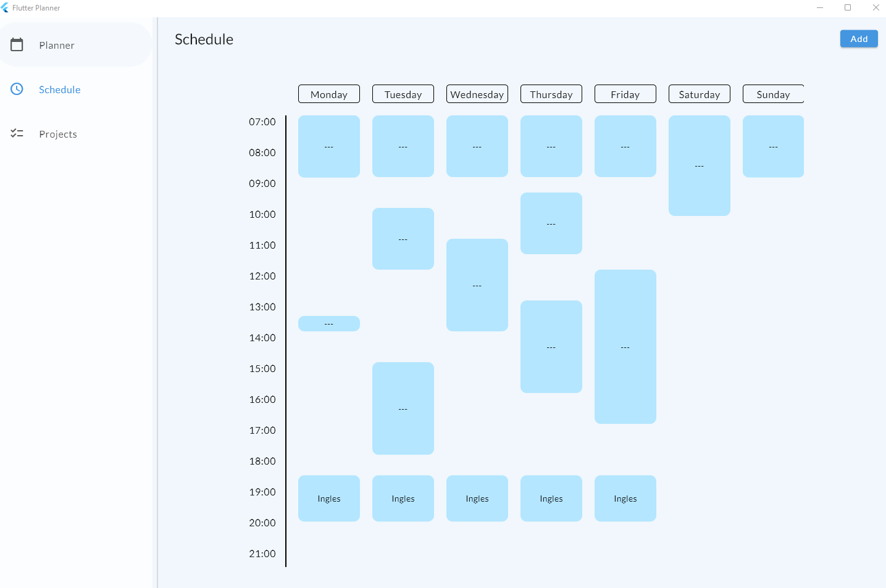
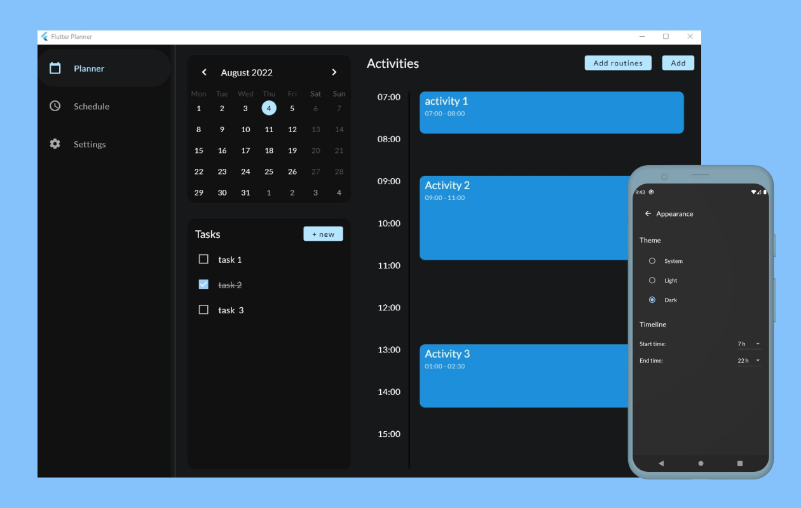

# Flutter Planner

[![style: very good analysis][very_good_analysis_badge]][very_good_analysis_link]
[![Codecov][codecov_badge]][codecov_link]
[![License: MIT][license_badge]][license_link]

A Flutter application to plan personal daily tasks, activities and routines that can be used with [Supabase](https://supabase.com/) or [Isar](https://isar.dev/) for the backend.


### Planner


### Schedule


### Dark theme


---
## Features

- 2 backend alternatives: Supabase and Isar.
- Email authentication (if used with Supabase).
- Calendar and timeline view for daily tasks and activities.
- Timetable for weekly routines.
- Activities types: task, routine, and event.
- Reminders for activities and remaining tasks*.
- Settings for user configuration, appearance, and tasks reminders.
- Responsive ui.

**reminders only work on android and ios (ios needs extra [set up](https://pub.dev/packages/flutter_local_notifications#-ios-setup))*

---
## Set up

### Supabase
*This step is only needed if you want to use this app with Supabase.*

1. Create a new project.
2. Create a new table, named routines with the following rows (RLS enable).
    | Name       | Type | Extra       | Other                                  |
    | ---------- | ---- | ----------- | -------------------------------------- |
    | id         | int8 | Is identity | -                                      |
    | user_id    | uuid | Is nullable | Foreign key (table: users, column: id) |
    | name       | text | -           | -                                      |
    | day        | int2 | -           | -                                      |
    | start_time | time | -           | -                                      |
    | end_time   | time | -           | -                                      |

3. Create a new table, named 'activities', with the following rows (RLS enable).

   | Name        | Type | Extra                        | Other                                     |
   | ----------- | ---- | ---------------------------- | ----------------------------------------- |
   | id          | int8 | Is identity                  | -                                         |
   | user_id     | uuid | Is nullable                  | Foreign key (table: users, column: id)    |
   | name        | text | Is nullable                  | -                                         |
   | type        | int2 | -                            | Default value: 0                          |
   | date        | date | -                            | -                                         |
   | start_time  | time | -                            | -                                         |
   | end_time    | time | -                            | -                                         |
   | description | text | Is nullable                  | -                                         |
   | links       | text | Is nullable, define as array | -                                         |
   | routine_id  | int8 | Is nullable                  | Foreign key (table: routines, column: id) |
   
4. Create a new table, named 'tasks', with the following rows (RLS enable).

   | Name      | Type | Extra       | Other                                  |
   | --------- | ---- | ----------- | -------------------------------------- |
   | id        | int8 | Is identity | -                                      |
   | user_id   | uuid | Is nullable | Foreign key (table: users, column: id) |
   | title     | text | Is nullable | -                                      |
   | date      | date | -           | -                                      |
   | completed | bool | -           | -                                      |

5. Create a new policy for all tables.
   - Allowed operation: ALL.
   - USING expression: auth.uid() = user_id.
   - WITH CHECK expression: (role() = 'authenticated'::text).
6. In authentication settings, disable email confirmations.
   
### Flutter

1. Clone this repo.
2. In the root directory, create a new file named '.env' with the following lines.
``` env
SUPABASE_URL=<YOUR_URL>
SUPABASE_ANON_KEY=<YOUR_KEY>
```

### Running the project⚡

Run the desired flavor (production is the flavor that uses Isar, development and staging are the same and use Supabase).

```sh
# Development (Supabase)
$ flutter run --flavor development --target lib/main_development.dart

# Staging (Supabase)
$ flutter run --flavor staging --target lib/main_staging.dart
  
# Production (Isar)
$ flutter run --flavor production --target lib/main_production.dart
```

### Running Tests 🧑‍🔬

To run all unit and widget tests use the following command:

```sh
flutter test --coverage --test-randomize-ordering-seed random
```

### Building the project

#### Android

```sh
# Development (Supabase)
$ flutter build apk --target lib/main_development.dart

# Staging (Supabase)
$ flutter build apk --target lib/main_staging.dart
  
# Production (Isar)
$ flutter build apk --target lib/main_production.dart
```

#### Windows

```sh
# Development (Supabase)
$ flutter build windows --target lib/main_development.dart
$ flutter pub run msix:create --build-windows false

# Staging (Supabase)
$ flutter build windows --target lib/main_staging.dart
$ flutter pub run msix:create --build-windows false
  
# Production (Isar)
$ flutter build windows --target lib/main_production.dart
$ flutter pub run msix:create --build-windows false
```

---

## Dependencies

- [dynamic_timeline](https://pub.dev/packages/dynamic_timeline)
- [flutter_bloc](https://pub.dev/packages/flutter_bloc)
- [supabase_flutter](https://pub.dev/packages/supabase_flutter)
- [isar](https://pub.dev/packages/isar)
- [go_router](https://pub.dev/packages/go_router)
- [flutter_local_notifications](https://pub.dev/packages/flutter_local_notifications)

---

## Contribution

If you have a suggestion or would to contribute feel free to [contact me](https://github.com/IvanHerreraCasas), fill an issue or make a pull request :).


[flutter_localizations_link]: https://api.flutter.dev/flutter/flutter_localizations/flutter_localizations-library.html
[internationalization_link]: https://flutter.dev/docs/development/accessibility-and-localization/internationalization
[license_badge]: https://img.shields.io/badge/license-MIT-blue.svg
[license_link]: https://opensource.org/licenses/MIT
[very_good_analysis_badge]: https://img.shields.io/badge/style-very_good_analysis-B22C89.svg
[very_good_analysis_link]: https://pub.dev/packages/very_good_analysis
[very_good_cli_link]: https://github.com/VeryGoodOpenSource/very_good_cli
[codecov_badge]: https://codecov.io/gh/IvanHerreraCasas/flutter_planner/branch/main/graph/badge.svg?token=P2SSNN4GKH
[codecov_link]: https://codecov.io/gh/IvanHerreraCasas/flutter_planner
